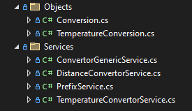

# Convertor-library
A modular class lib for converting different units provided by textual input. Some units have specific rules, such as temperature conversions, which are sometimes not linear. That is why this library is modular to provide for these rules.

The Solution is separated into:
- ConvertorLibs - The Library class project
- ConvertorTest - Basic NUnit tests for one of the implementations

## Usage
After creating a derived specific service or using one of the built in ones, you can check if the service can convert the units provided.
After this you can safely convert the units.

    

## Interface IConvertorGenericService
The basic interface consists of two methods:
-   string Convert(string from, string to);
    - Converts the specified unit with the amount to the target unit. Both can have a prefix
-  bool CanConvert(string input1, string input2);
    - Determines whether this instance can convert the specified input1 into input2.

## Interface IConversion
### Methods 
The basic interface consists of two methods and two required members:
-   string Convert(int amount, int prefix, int postfix);
    - Converts the specified amount of units into different units with prefixes.
-   string ConvertInverse(int amount, int prefix, int postfix);
    - Converts the specified amount of units in reverse order.
### Types     
- public string FromTypes { get; set; }
    - The comma delimited string of possible formats of source unit without prefix, different types based on derived classes
- public string ToTypes { get; set; }
    - The comma delimited string of possible formats of target unit without prefix, different types based on derived classes

## Expandability of this library

If you want to implement your own convertor, you must:
### 1 - Concrete implementation of your service
- Implement your own concrete class inheriting the ConvertorGenericService BASE class, that in turn uses the IConvertorGenericService interface described above.

    

 - In the constructor, you can register the conversions of different formats separated by commas.
 - The coefficient specifies the conversion rate.

### 2 - Implement specific rules for your convertor
- You can implement specific logic for the calculation of your module in the concrete class inheriting from the interface IConversion.

    

## Folder structure
You can find the Available services inside the Services folder and the Different conversion classes inside Conversions.

    

